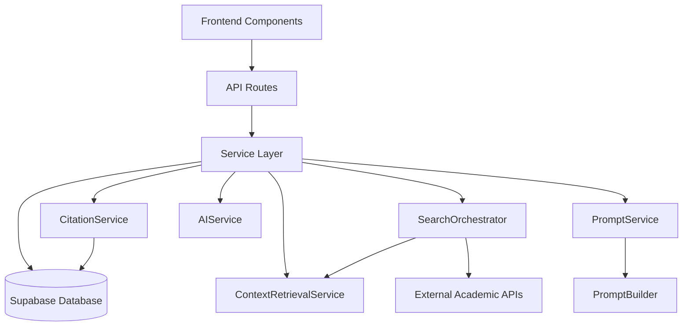

# GenPaper Architecture Overview

This document provides a comprehensive overview of GenPaper's architecture, service boundaries, and key design decisions.

## Table of Contents
- [System Overview](#system-overview)
- [Core Services](#core-services)
- [Data Flow](#data-flow)
- [Module Boundaries](#module-boundaries)
- [Feature Flags](#feature-flags)
- [API Design](#api-design)
- [Performance & Observability](#performance--observability)
- [Architecture Decision Records](#architecture-decision-records)

## System Overview

GenPaper is a modular, service-oriented AI-powered research paper generation platform built on Next.js with Supabase backend. The architecture emphasizes:

- **Service isolation**: Clear boundaries between concerns
- **Unified citation management**: Single source of truth for citations
- **Centralized search**: All retrieval goes through SearchOrchestrator
- **Feature flag safety**: Runtime toggles for safe deployments
- **Streaming architecture**: Real-time content generation with SSE



## Core Services

### CitationService (`lib/citations/immediate-bibliography.ts`)

**Purpose**: Centralized validation, CSL normalization, and persistence for all citations.

**Key Methods**:
- `add(params)`: Idempotent citation creation with race-safe uniqueness
- `resolveSourceRef({doi, title, year})`: Resolve citations from various source formats
- `renderInline(cslJson, style, number)`: Format citations for inline display
- `renderBibliography(projectId, style)`: Generate complete bibliography

**Features**:
- DOI normalization and fuzzy title matching (Levenshtein ≤2)
- CSL validation with Zod + citation-js
- `UNIQUE(project_id, paper_id)` constraint prevents duplicates
- Supports APA, MLA, Chicago, IEEE citation styles

### SearchOrchestrator (`lib/services/search-orchestrator.ts`)

**Purpose**: Single hub for all search operations (Library, Hybrid, Academic APIs).

**Key Methods**:
- `search({query, projectId, maxResults, includeLibraryOnly})`: Main search interface
- `searchLibrary({query, projectId})`: Library-only search
- `retrieveChunks({query, projectId, k})`: Unified chunk retrieval

**Features**:
- Per-request LRU cache with >90% hit rates
- Parallel execution across multiple sources
- Timeout handling and graceful degradation
- Provenance tracking for search results

### ContextRetrievalService (`lib/generation/context-retrieval-service.ts`)

**Purpose**: Unified embeddings + keyword search with intelligent ranking.

**Features**:
- Hybrid semantic + keyword search
- Project-scoped filtering
- Adaptive scoring based on content quality
- Caching for repeated queries within requests

### AIService (`lib/ai/ai-service.ts`)

**Purpose**: Isolates Vercel AI SDK usage and streaming concerns.

**Features**:
- Mockable interface for testing
- Error handling and event transformation
- Streaming text generation with tool calls
- Rate limiting and quota management

### PromptService & PromptBuilder

**PromptService** (`lib/prompts/prompt-service.ts`): Template loading wrapper with I/O
**PromptBuilder** (`lib/core/prompt-builder.ts`): Pure prompt construction (no I/O)

**Features**:
- Template caching and Mustache rendering
- Evidence snippet formatting
- Section coherence and word targeting
- Dependency injection for testability

## Data Flow

### Citation Workflow

#### Immediate Citations (Current)
```
AI Tool → /api/citations → CitationService.add() → Database
UI Component → /api/citations → CitationService.add() → Database
```

#### Placeholder Citations (Feature Flagged)
```
AI Model → [[CITE:doi:10.1234]] → Batch Resolver → CitationService.resolveSourceRef() → CitationService.add()
```

### Search Workflow
```
Query → SearchOrchestrator → ContextRetrievalService → [Academic APIs, Hybrid Search, Library] → Ranked Results
```

### Generation Workflow
```
User Request → /api/generate/unified → GenerationOrchestrator → [PromptBuilder, AIService, CitationService] → SSE Stream
```

## Module Boundaries

Module boundaries are enforced via ESLint and dependency-cruiser:

### Allowed Imports
- **Services** (`lib/services/*`): Can import from `lib/db/*`, `lib/supabase/*`
- **API Routes** (`app/api/*`): Can import from `lib/services/*`
- **Components** (`app/*`, `components/*`): Can import from `lib/services/*` only
- **AI Tools** (`lib/ai/tools/*`): Must use API endpoints, not direct DB

### Forbidden Imports
- Components → `lib/db/*` or `lib/supabase/*` (use services instead)
- AI Tools → `lib/db/*` or `lib/supabase/*` (use API endpoints)

```javascript
// ESLint Rule Example
{
  "no-restricted-imports": [
    "error",
    {
      "patterns": [
        {
          "group": ["@/lib/db/*", "@/lib/supabase/*"],
          "message": "App/Component should only import from @/services/* for data access"
        }
      ]
    }
  ]
}
```

## Feature Flags

Runtime toggles for safe rollout of new pipeline features:

```typescript
// Generation Pipeline Flags

// Architecture Flags  
Flags retired: unified citations, batched placeholders, orchestrator-only search, service-layer-only, diff editor, edits API, and citation offsets are permanent.
```

## API Design

### RESTful Endpoints
- `GET /api/papers?library=me` - Unified papers API
- `POST /api/citations` - Citation management (single & batch)
- `POST /api/library-search` - Library search via orchestrator

### Streaming Endpoints
- `POST /api/generate/unified` - SSE stream for content generation

### Request/Response Patterns

**Citation API (Batch)**:
```typescript
POST /api/citations
{
  "projectId": "uuid",
  "refs": [
    {"type": "doi", "value": "10.1234/example", "context": "supports claim"},
    {"type": "title", "value": "Paper Title", "fallbackText": "(Source, n.d.)"}
  ]
}

Response:
{
  "success": true,
  "citeKeyMap": {
    "doi:10.1234/example": "(Smith et al., 2023)",
    "title:Paper Title": "(Source, n.d.)"
  },
  "results": [...],
  "processed": 2,
  "successful": 1
}
```

## Performance & Observability

### Metrics & Tracing
- **Request IDs**: Track generations across logs/metrics
- **Span Tracing**: `prompt_building`, `llm_streaming`, `batch_resolution`
- **Latency Targets**: ≤200ms p95 for section generation under 100 RPS
- **Cache Hit Rates**: >90% for retrieval within same request

### Performance Optimizations
- LRU caching for search results and prompts
- Parallel execution for search strategies
- Streaming response for real-time UX
- Batch citation resolution (vs individual API calls)

### Error Handling
- Graceful fallbacks for failed citations
- Timeout protection for external APIs
- Retry logic with exponential backoff
- Client-side notifications via Sonner toasts

## Architecture Decision Records

### ADR-001: Unified Citation Service

**Status**: Implemented

**Context**: Previously had duplicate citation logic in UI and AI tool paths, leading to inconsistencies and maintenance burden.

**Decision**: Create a single `CitationService` that both UI and AI tools use via API endpoints.

**Consequences**:
- ✅ Eliminated duplicate citation logic
- ✅ Consistent formatting across all citation sources
- ✅ Easier to add new citation styles
- ✅ Idempotent operations prevent race conditions
- ⚠️ Added API call overhead for AI tools (mitigated by batching)

### ADR-002: SearchOrchestrator Pattern  

**Status**: Implemented

**Context**: Search logic was scattered across Library, Hybrid, and Academic API modules, making it hard to optimize and maintain.

**Decision**: Centralize all search through `SearchOrchestrator` with per-request caching.

**Consequences**:
- ✅ Single source of truth for all search operations
- ✅ Consistent caching and timeout handling
- ✅ Easier to add new search sources
- ✅ >90% cache hit rates for repeated queries
- ⚠️ Slightly more complex call stack (mitigated by clear interfaces)

### ADR-003: Project Service API (SSE)

**Status**: Implemented

**Context**: Frontend made multiple API calls during generation (search, generate, citations), creating complex state management.

**Decision**: Create unified `/api/generate/unified` SSE endpoint that handles the complete generation workflow.

**Consequences**:
- ✅ Simplified frontend integration (single SSE stream)
- ✅ Better error handling and user feedback
- ✅ Reduced network overhead
- ✅ Real-time progress updates
- ⚠️ More complex server-side orchestration

### ADR-004: Module Boundary Enforcement

**Status**: Implemented

**Context**: Components and AI tools were directly importing database modules, creating tight coupling.

**Decision**: Enforce boundaries via ESLint and dependency-cruiser rules.

**Consequences**:
- ✅ Clear separation of concerns
- ✅ Easier testing and mocking
- ✅ Prevents accidental direct DB access
- ✅ Clearer upgrade path for database changes
- ⚠️ Requires discipline in following patterns

## Database Schema

### Core Tables

**project_citations** (Unified Citation Table):
```sql
CREATE TABLE project_citations (
  id UUID PRIMARY KEY,
  project_id UUID REFERENCES research_projects(id) ON DELETE CASCADE,
  paper_id UUID REFERENCES papers(id) ON DELETE CASCADE,
  csl_json JSONB NOT NULL,
  cite_key TEXT NOT NULL,
  -- citation_number removed, using first_seen_order for render-time numbering
  reason TEXT,
  quote TEXT,
  first_seen_order INTEGER NOT NULL,
  created_at TIMESTAMPTZ DEFAULT now(),
  
  UNIQUE(project_id, paper_id),  -- Prevents duplicates
  UNIQUE(project_id, cite_key)   -- Stable references
);
```

**papers** (Research Papers):
```sql
CREATE TABLE papers (
  id UUID PRIMARY KEY,
  title TEXT NOT NULL,
  doi TEXT UNIQUE,
  csl_json JSONB,
  embedding VECTOR(384),
  search_vector TSVECTOR,
  -- ... other fields
);
```

## Contributing

When implementing new features:

1. **Follow module boundaries**: Use services for data access
2. **Add feature flags**: For risky changes or new workflows  
3. **Update tests**: Include contract tests for UI/AI parity
4. **Document decisions**: Add ADRs for significant architectural changes
5. **Maintain performance**: Verify latency targets and cache hit rates

## Related Documentation

- [Tasks Management](./tasks.md) - Development roadmap and task tracking
- [API Documentation](./README.md#api-endpoints) - Endpoint specifications
- [Database Schema](./supabase/shema/shema.md) - Complete database schema
- [Testing Strategy](./test/README.md) - Testing patterns and practices