Below is a pragmatic pattern that’s worked well for production “AI ⇢ paper” pipelines.  Most of it can live in a tiny **CitationService** (or hook) that your generator calls every time it needs to mention a source.

---

### 1.  Persist *canonical* metadata first

Before you ever start text generation, ingest every candidate paper into a
`papers` table with a stable **paper\_id** (UUID or DOI).  This gives you a single-source-of-truth record:

```sql
papers
┌────────────┬──────────────┬────────┬───────┬────────────┐
│ paper_id   │ title        │ year   │ doi   │ json_meta  │
└────────────┴──────────────┴────────┴───────┴────────────┘
```

That same `paper_id` flows through retrieval chunks, RAG indices *and* citation-tracking, so you never have to guess which “Smith et al., 2020” the model meant.

---

### 2.  Let the model write **place-holders**, not finished citations

| Prompt style | Example the model emits                          |
| ------------ | ------------------------------------------------ |
| Numeric      | “…as shown previously \[\[cite:7efe-41be]]”      |
| Author-year  | “…as noted by Smith et al. \[\[cite:7efe-41be]]” |

The LLM only needs to know the `[[cite:paper_id]]` alias—you map that to the final label later.
A thin helper in the prompt template is enough:

```ts
function cite(paper: Paper) {
  return `[[cite:${paper.paper_id}]]`;
}
```

---

### 3.  A single **CitationManager** turns IDs → labels

```ts
export class CitationManager {
  private sequence: string[] = [];      // in-order appearance
  private lookup = new Map<string,number>();

  cite(id: string) {
    if (!this.lookup.has(id)) {
      this.lookup.set(id, this.sequence.length + 1);
      this.sequence.push(id);
    }
    return this.lookup.get(id)!;       // 1-based label
  }

  bibliography(style: 'apa' | 'mla' | 'chicago') {
    return this.sequence.map(id => formatBib(id, style));
  }
}
```

* **`cite()`** returns the running label (`1`, `2`, `3` …) no matter how many times the same paper is cited.
* **`bibliography()`** uses CSL or BibTeX (`citeproc-js`, `citeproc-rs`, `bibtex-parser`) to spit out fully-formatted references.

---

### 4.  Post-processing pass

1. Run a regex over the model’s draft:
   `\[\[cite:([^\]]+)\]\]`
2. Swap each placeholder with the `CitationManager.cite(id)` result.
   *Numeric style* → `[3]`; *author-year* → `(Smith et al., 2020)`; etc.
3. Append or inject the bibliography made by `CitationManager.bibliography()`.

Because the mapping is deterministic, you can regenerate a paragraph, re-run the pass and everything renumbers automatically.

---

### 5.  Support for multiple styles

*Keep the body neutral*—only the bibliography and inline rendering change.
Store (or generate) full CSL JSON for every paper once:

```json
{
  "id": "7efe-41be",
  "author": [{ "family": "Smith", "given": "John" }],
  "issued": { "year": 2020 },
  "title": "Awesome finding",
  "container-title": "J. Interesting Results",
  "DOI": "10.5555/123456"
}
```

Switching from IEEE to APA is a single `citationStyle = 'apa'` flag.

---

### 6.  Faithfulness / hallucination guard

1. **Retrieve-then-write**:
   feed the LLM the chunks *plus* the paper metadata, so it only cites papers it’s actually seen.
2. **Post-hoc verifier**:
   run a fast rule-based pass that flags any citation that doesn’t have a retrieval score ≥ τ or whose quoted fact isn’t present in the chunk.

---

### 7.  Edge-case handling

* Duplicate citation in the same sentence → dedupe placeholders before post-processing.
* Missing metadata (no year, no author) → fall back to “Title, n.d.” style.
* Secondary sources → support `[[cite:primary|secondary]]` syntax so you can print “(Smith, 2020, as cited in Doe, 2022)”.

---

### 8.  Tiny end-to-end example

```md
The large margin perceptron [[cite:abc123]] outperformed
standard SVMs [[cite:def456]] on noisy datasets.

### References
[1] Smith, J. (2020). *Large margin perceptron*. …
[2] Doe, A. (2022). *Robust SVMs revisited*. …
```

No matter how many times you regenerate the intro, the service keeps the numbers stable per rendering pass.

---

### TL;DR

1. **Store** every source with a canonical `paper_id`.
2. **Generate** with lightweight `[[cite:id]]` placeholders.
3. **Resolve** those placeholders in a deterministic post-processor that:

   * assigns sequential labels,
   * formats the in-text citation for the chosen style,
   * builds the bibliography.

That gives you fast, style-agnostic, and *hallucination-resistant* citations with minimal overhead.
Of course. Handling citations correctly is arguably the most critical and challenging part of creating a credible AI research paper generator. Simply asking the AI to "add citations" will lead to hallucinated sources and plagiarism.

Based on our entire debugging journey and best practices for building reliable AI systems, here is a detailed architectural blueprint for how I would handle citation insertion.

### Core Philosophy: Treat Citations as Structured Actions, Not Text

The fundamental principle is to **never trust the AI to format citations directly.** The AI's job is to identify *what* information comes from a source, not to write `(Author, Year)`. Citation is a structured action, not a creative writing task. This is achieved using **AI Tools** (also known as Function Calling).

Here is the complete, four-stage architecture for a robust citation system:

-----

### Step 1: The Foundation - A "Citeable" Knowledge Base

Before you even begin generation, your data must be prepared correctly. This is the most important step.

1.  **Deterministic Paper IDs:** Every source paper in your system must have a stable, unique, and deterministic ID. You have already solved this with your `generateDeterministicPaperId` function. This is the anchor for all citations.

2.  **Content Chunking:** The full text of each paper must be broken down into smaller, manageable chunks (as your `splitIntoChunks` function does).

3.  **Tagging Each Chunk with its Source:** This is critical. When you store the chunks in your vector database (`paper_chunks` table), each chunk record **must** include the `paper_id` of the document it came from. This creates an unbreakable link between a piece of information and its source.

Without this foundation, no reliable citation system is possible.

### Step 2: The Mechanism - A Dedicated `addCitation` Tool

Instead of letting the AI write free-form text, you give it a specific tool it can call. This is the core of the solution and replaces your old "synthetic tool call" workaround.

  * **Define the Tool:** Using the Vercel AI SDK or a similar library, you define a tool the AI can use.
    ```typescript
    // In a file like lib/ai/tools/addCitation.ts
    import { tool } from 'ai';
    import { z } from 'zod';

    export const addCitation = tool({
      description: "Call this tool IMMEDIATELY after a sentence or claim that uses information from a provided source. Do not cite your own general knowledge.",
      parameters: z.object({
        // The AI must provide the ID of the paper it's citing.
        paperId: z.string().describe("The unique ID of the source paper being cited."),
        // The AI explains WHY it's citing this source.
        reason: z.string().describe("A brief explanation for why this source supports the claim."),
        // Optional: The AI can provide the exact quote for verification.
        quote: z.string().optional().describe("The verbatim quote from the source that supports the claim."),
      }),
      execute: async ({ paperId, reason, quote }) => {
        // This function runs on your server when the AI calls the tool.
        // It validates the paperId, looks up the metadata, and prepares the citation.
        
        // 1. Look up paper metadata (Author, Year, etc.) from your database using paperId.
        const paperInfo = await getPaperMetadata(paperId); 

        // 2. Create a unique placeholder for this specific citation instance.
        const citationKey = `CITE-${crypto.randomUUID().slice(0, 8)}`;

        // 3. Store the structured citation data in a temporary map for this generation request.
        citationMap.set(citationKey, {
          paperId: paperId,
          author: paperInfo.author,
          year: paperInfo.year,
          reason,
          quote
        });

        // 4. Return ONLY the placeholder to the AI.
        return {
          success: true,
          // This is the text that gets inserted into the document.
          textToInsert: ` [${citationKey}]` 
        };
      }
    });
    ```

### Step 3: The Prompting Strategy - Clear Instructions

You must explicitly tell the AI how and when to use this tool in your system prompt.

> **CRITICAL CITATION RULES:**
>
> 1.  You are provided with context from several source documents. Each piece of information is tagged with its source ID (e.g., `[CONTEXT FROM: paper-xyz-123]`).
> 2.  Immediately after you write a sentence that uses information from one of these sources, you **MUST** call the `addCitation` tool.
> 3.  In the `paperId` parameter of the tool, you **MUST** provide the exact source ID of the context you used.
> 4.  **DO NOT** write citations like `(Smith, 2022)` yourself. The tool will insert a placeholder like `[CITE-xxxx]`, and the system will format it later. Failure to use the tool is a failure to follow instructions.

### Step 4: Finalization - "Hydrating" Citations and References

After the AI finishes generating the draft (which now contains placeholders like `[CITE-1234abcd]`), the final step is to replace them with properly formatted citations and build the reference list.

1.  **Replace Placeholders:** Your application code iterates through the generated text. When it finds a placeholder like `[CITE-1234abcd]`, it looks up the corresponding structured data in the map that was populated during the `addCitation` tool calls.
2.  **Format In-Text Citations:** Using a CSL (Citation Style Language) library, it formats the structured data into the user's desired style (e.g., APA: `(Smith, 2023)`, MLA: `(Smith 12)`).
3.  **Generate Reference List:** After replacing all placeholders, the application takes all the unique citations used in the paper, formats them into a full reference list, and appends it to the end of the document under a "References" or "Works Cited" heading.

### Architectural Diagram of the Flow

```mermaid
sequenceDiagram
    participant App as ⚙️ Your App Server
    participant AI as 🧠 AI Model
    participant CitationTool as 🛠️ addCitation Tool
    participant Formatter as ✍️ Final Formatter

    App->>AI: Generate "introduction" using context from paper-123
    AI->>App: "AI is revolutionizing healthcare..."
    App->>AI: (continue generating)
    AI->>CitationTool: call addCitation(paperId: "paper-123", reason: "...")
    CitationTool->>CitationTool: Validate ID, store metadata
    CitationTool-->>AI: return { textToInsert: " [CITE-A]" }
    AI->>App: "...by improving diagnostics [CITE-A]."
    
    Note over App, Formatter: --- Generation Complete ---

    App->>Formatter: Process final text: "...diagnostics [CITE-A]."
    Formatter->>Formatter: 1. Find "[CITE-A]"
    Formatter->>Formatter: 2. Look up metadata for CITE-A
    Formatter->>Formatter: 3. Format as APA: "(Smith, 2023)"
    Formatter->>Formatter: 4. Generate "References" section
    Formatter-->>App: Return final, formatted document
```



### Benefits of this Architecture

  * **Accuracy:** Citations are never hallucinated. They are always programmatically linked to a real source document that was used as context.
  * **Flexibility:** You can instantly change the citation style (APA, MLA, etc.) by just changing the final formatting step, without needing to re-generate the entire paper.
  * **Verifiability:** You have a structured log of every citation event, including the AI's reasoning (`reason`) and the specific `quote` it used.
  * **Trust:** This is how you build an academically honest tool that users can rely on.

  That design is **solid**—it nails the two things that trip most “AI + citations” projects:

1. **Ground-truth first, prose second** (canonical `paper_id` → chunk → retrieval).
2. **Treating citation as a *function call*, not free-form text.**

Below are a handful of refinements you may find useful once the system is running at scale or in edge-cases.

---

## 1 ️⃣  Tighten the retrieval→tool‐call contract

| Risk                                                                                                   | Mitigation                                                                                                                                                                                                                                                                        |
| ------------------------------------------------------------------------------------------------------ | --------------------------------------------------------------------------------------------------------------------------------------------------------------------------------------------------------------------------------------------------------------------------------- |
| *The model cites a chunk that scored low in retrieval* (e.g., cross-document semantic bleed).          | When you build the retrieval context, prepend each chunk with a short “header” containing both the `paper_id` **and** the retrieval score. Then instruct the LLM: “Only cite chunks with score ≥ τ.” A second rule-based pass can discard tool calls whose originating score < τ. |
| *Over-citation* (model calls `addCitation` after every sentence in a paragraph using the same source). | Maintain a short-term in-memory cache keyed by `(paperId, currentSection)`; if the same paper was cited < N tokens ago, silently turn the tool call into a no-op.                                                                                                                 |

---

## 2 ️⃣  Concurrency & idempotency

*Generation* and *hydration* often run in different serverless invocations. Make sure the `citationMap` lives…

* **Per request**: store it in a request-scoped KV/Redis entry (`ctx.requestId` key).
* **Idempotent**: if hydration re-runs, it should detect placeholders already replaced and skip.

> **Tip** Encode the placeholder as `⟦cite:uuid⟧` (double-angle or curly braces) instead of square brackets to avoid collisions with Markdown links.

---

## 3 ️⃣  Secondary-source & multi-cite syntax

You hinted at it—here’s a concrete pattern that survives hydration:

```md
… as shown by ⟦cite:primaryId|as cited in|secondaryId⟧ …
```

During hydration you expand to:

> *(Smith 2020, as cited in Doe 2022)*

and both IDs flow into the reference list.

---

## 4 ️⃣  Editing & regeneration loops

Writers will regenerate individual paragraphs. If paragraph #3 is regenerated and now *drops* a source that was previously citation \[5], you need renumbering across the whole doc.

* Run hydration **fresh every time you export** (don’t store final numbers in the DB).
* The cost is O(#citations); negligible compared with model inference.

---

## 5 ️⃣  “Missing metadata” guard-rails

Some papers come in from Crossref without author or year. Hydration should downgrade gracefully:

*In-text* → `(“Untitled preprint”, n.d.)`
*Reference* → `“Untitled preprint”. (n.d.). doi:10.xxxx/xxxx`

…and **log** any placeholder that required fallbacks so you can patch the source DB later.

---

## 6 ️⃣  Quote verification (optional but powerful)

Store `quote` (or even the *offset* in the chunk) that the LLM claims.
A lightweight verifier can:

1. Check Levenshtein distance between quote and original text (< ε).
2. Flag any mismatch for manual review or automatic regeneration of that sentence.

This is surprisingly effective at catching hallucinated paraphrases.

---

## 7 ️⃣  Performance tips

* **Batch DB lookups** in hydration—fetch metadata for *all* `paperId`s in one SQL `WHERE id IN (...)`.
* Cache formatted CSL strings keyed by `(paperId, style)`; avoids re-running citeproc on every export.
* If you serve multiple citation styles, keep the CSL JSON in the `papers` table so you don’t re-build it.

---

## 8 ️⃣  UI/UX niceties

* Hover tooltip on a citation → show the abstract & “why we cited this”.
* Toggle to switch style (APA ⇋ IEEE) live—since hydration is deterministic and fast, you can regenerate client-side.

---

### 🎯  TL;DR Extensions

Your blueprint already covers the critical path. The additions above harden it against:

* noisy retrieval,
* concurrent runs and re-runs,
* citation numbering drift,
* and missing / dubious metadata.

Implement once, and you’ll spend your time on better prompts—not on chasing phantom references. Good luck, and feel free to ping back when you’re stress-testing on real manuscripts!
Short answer: **keep the backbone of *your* design and graft in a few of the guard-rails I suggested.**
The two plans are >90 % identical in philosophy; the differences are mostly in enforcement details and “nice-to-have” resilience features. Here’s a side-by-side so you can see exactly what you’d be choosing.

| Feature / Decision                                            | Your Blueprint         | My Add-ons                                                             | Why It Matters                                                                           |
| ------------------------------------------------------------- | ---------------------- | ---------------------------------------------------------------------- | ---------------------------------------------------------------------------------------- |
| **Structured tool call (`addCitation`) instead of free-text** | ✅                      | ✅ *(same)*                                                             | Non-negotiable for hallucination control.                                                |
| **Deterministic paper IDs + chunk metadata**                  | ✅                      | ✅ *(same)*                                                             | Anchor for every downstream step.                                                        |
| **LLM instructed to call the tool immediately after a fact**  | ✅                      | + rule to *skip* duplicate calls within N tokens                       | Cuts “citation spam” while staying precise.                                              |
| **Placeholder token format**                                  | `[CITE-xxxx]`          | `⟦cite:uuid⟧` (or similar high-entropy token)                          | Angle-bracket form avoids clashing with Markdown links and makes regex extraction safer. |
| **Hydration / reference-list builder**                        | Single pass at the end | Idempotent & runs fresh on every export (protects live-edit scenarios) | Prevents numbering drift when users regenerate only one section.                         |
| **Quote / offset logging**                                    | Optional               | Optional + automated quote-verification (Levenshtein check)            | Lets you flag hallucinated quotes without manual reading.                                |
| **Retrieval score threshold**                                 | —                      | Reject tool calls for chunks below τ                                   | Avoids citing low-relevance fragments.                                                   |
| **Caching & batching**                                        | —                      | Batched DB fetch + CSL cache                                           | Pure performance; negligible effort, big latency win.                                    |
| **Missing-metadata fallback**                                 | —                      | Graceful `(“Untitled preprint”, n.d.)` + error log                     | Stops generation failures on weak Crossref records.                                      |
| **UI goodies (hover abstract, live style toggle)**            | —                      | Suggested                                                              | Fully optional, but users love it.                                                       |

### How I’d merge them

1. **Adopt your four-stage flow verbatim** for retrieval → drafting → tool calls → hydration.

2. **Drop in the extra guards as middleware**, not model-facing changes, so you don’t have to re-prompt or retrain:

   * a tiny post-processing script that discards duplicate calls and low-score citations,
   * a reusable `hydrateCitations()` helper that is idempotent and caches CSL output,
   * an optional quote-verifier that runs asynchronously and flags issues in logs.

3. **Run an A/B smoke test**: generate 100 abstracts with the plain version vs. the guarded version and count (a) missing citations, (b) duplicate citations, (c) hydration failures. You’ll see the extras pay for themselves.

---

### TL;DR

*Your* blueprint already nails the core problem.
*Mine* just adds seatbelts, airbags, and cup-holders.

Implement the core exactly as you’ve drawn it, sprinkle in whichever of the safety features feels worth the engineering time right now, and you’ll have a system that’s robust today **and** scales gracefully when users start hammering it.
